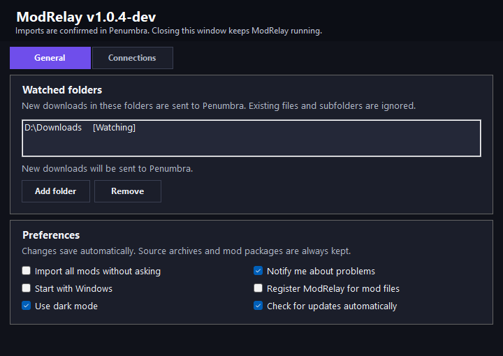
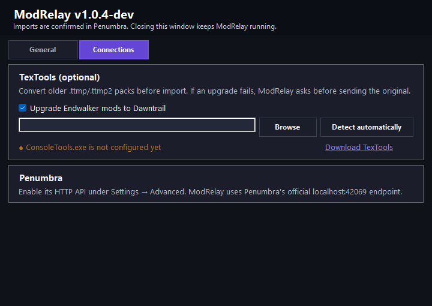

# ModRelay

A small Windows tray app that sends downloaded FFXIV mod packages to Penumbra. Penumbra handles the import and shows its result in game; ModRelay stays quiet unless something needs attention.



<details>
<summary>Connections</summary>



</details>

## Setup

1. Download `ModRelay-win-x64.zip` from the [latest release](https://github.com/Nana1873/ModRelay/releases/latest), then extract the `ModRelay` folder to a writable location. An adjacent `.sha256` file is available to verify the download.
2. Run `ModRelay.exe` and choose your download folders. Watching starts when you close the first-run settings window.
3. In Penumbra, enable **HTTP API** under **Settings → Advanced**. ModRelay uses the local endpoint on port `42069`.
4. Optionally enable upgrades for older `.ttmp`/`.ttmp2` packs under **Connections**. Install [FFXIV TexTools](https://github.com/TexTools/FFXIV_TexTools_UI/releases) and select its `ConsoleTools.exe` if automatic detection cannot find it.

Changes save automatically. Closing settings leaves ModRelay running in the notification area. Double-click its tray icon to reopen settings. Each folder shows whether it is actually being watched, with details for unavailable folders. The tray shows the remaining queue and provides manual import, pause/resume watching, **Cancel current operation**, connection and update checks, the log, and exit.

## How imports work

- Watches new downloads directly inside the selected folders. Existing files and subfolders are ignored; use manual import for existing downloads.
- Supports `.ttmp`, `.ttmp2`, `.pmp`, `.pcp`, `.zip`, `.7z`, and `.rar`.
- Finds mod packages in archive subfolders. Archives containing several packages ask which to extract, unless **Import all mods without asking** is enabled. Archive paths distinguish same-name variants.
- Optionally runs TexTools `/upgrade` before handing `.ttmp`/`.ttmp2` files to Penumbra. `.pmp` and `.pcp` go directly to Penumbra. A failed upgrade requires your confirmation before the unchanged original is sent.
- Saves new jobs, archive selections, and preparation progress before handing anything off. A restart resumes unfinished work without repeating accepted archive entries or completed conversions. Packages waiting for Penumbra are retried when the game and API become available.
- Lets you cancel extraction, an upgrade, or a pending choice from the tray. This skips the current file and the unsent remainder of its archive, then continues with the next job. Cancelling an upgrade stops the TexTools process ModRelay started. Cancellation is disabled during a Penumbra handoff, which cannot be undone here.
- Keeps source archives and packages, including after extraction or conversion. Penumbra's HTTP response acknowledges the handoff, not completion; check the import in Penumbra before deleting files yourself.
- Sends accepted requests silently. Rejected or interrupted handoffs need manual review and are not repeatedly submitted. Problem notifications use Windows' notification area and can be disabled in settings.

The tool also offers Windows startup, optional per-user file registration, light/dark appearance, and a release-page link when an update is available. Updates are installed manually. File registration adds ModRelay to **Open with**; Windows controls the default app. After moving the portable folder, toggle startup or file registration off and on to update their paths.

## Files and troubleshooting

`settings.json` lives beside `ModRelay.exe`; the adjacent `data` folder contains logs and the pending queue. Keep both when replacing the executable. Obsolete settings from older versions disappear on the next save. Automatic source deletion, conversion-only mode, silent upgrade fallback, custom notification overlays, and success/tray/sound notification switches have been removed. If you previously disabled forwarding, reselect your watched folders to start forwarding; the old settings are preserved as `settings.json.before-simplification` so this change cannot silently enable watching.

Only one ModRelay instance runs at a time. If a new build opens an older version, choose **Exit** in the old tray menu before starting the new executable.

If an import does not appear, check Penumbra in game, then use **Check Penumbra connection** and **Open log** from the tray menu. Interrupted handoffs or upgrades appear as **imports needing review**; that tray entry opens the log with the affected paths. A handoff may already have reached Penumbra, so verify before retrying manually. Logs include local paths and mod filenames; review them before sharing.

If the tray says **Queue not saved**, keep ModRelay running and restore write access to its `data` folder. Processing waits until saving works again. A restart before that point can lose newly queued work or resume a cancellation that could not be saved.

Archive extraction rejects unsafe Windows file names and stops at 32 GB or before consuming the drive's final 512 MB. Generated files are ignored by the watcher. If existing settings cannot be read, ModRelay preserves a backup where possible and leaves the watch list empty for you to reconfigure. Personal settings and runtime files are excluded from source control and release packages.

## Development

Requires the .NET 10 SDK and 64-bit Windows. The self-contained release supports Windows 10 version 1809 or newer and does not require a separate .NET installation.

```powershell
dotnet restore ModRelay.sln
dotnet build ModRelay.sln -c Release --no-restore -warnaserror
dotnet test ModRelay.sln -c Release --no-build
dotnet publish src\ModRelay.App\ModRelay.App.csproj -c Release -r win-x64 --self-contained true --no-restore
```

Release builds embed their repository and version for the official GitHub update check. Development builds without repository metadata do not query an update server. Release tags must point to a commit on `main`.

## Credits and license

Inspired by [Penumbra Mod Forwarder](https://github.com/Sebane1/PenumbraModForwarder) and [Atomos](https://github.com/CouncilOfTsukuyomi/Atomos). ModRelay was built independently and includes no source or assets from either project. It is not affiliated with or endorsed by those projects, Penumbra, or TexTools.

MIT — see [LICENSE](LICENSE). Dependency and runtime notices are listed in [THIRD-PARTY-NOTICES.md](THIRD-PARTY-NOTICES.md).
